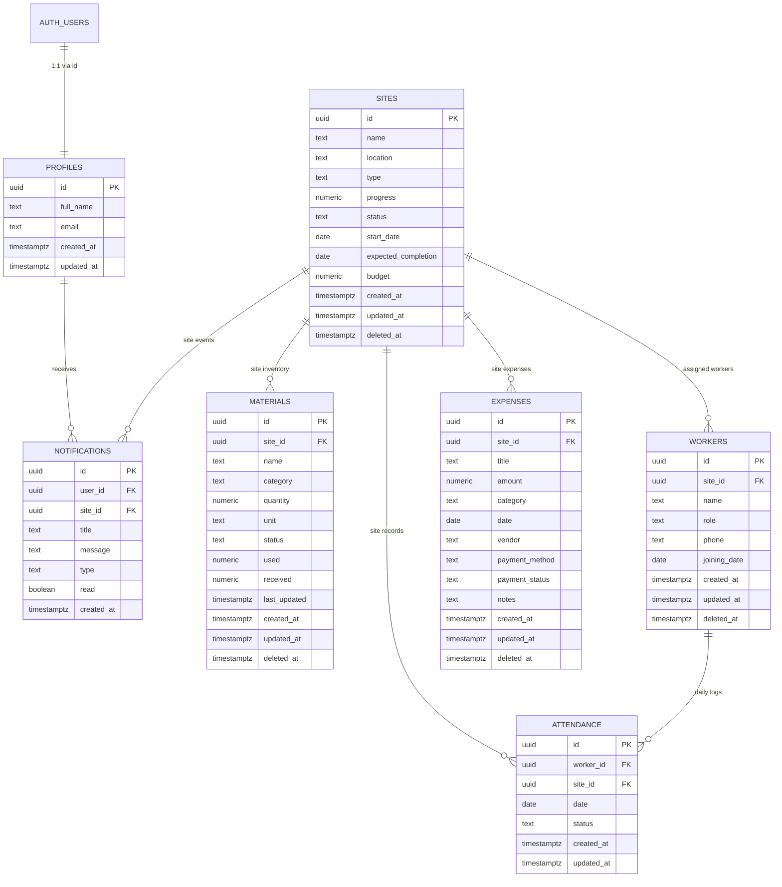

# GRN Construction - Supabase Database Setup & Architecture Guide

This document outlines the database schema, security policies, and deployment steps for the GRN Construction mobile application backend on Supabase.

---

## 1. Migration Overview

- **Migration File**: `supabase/migrations/001_initial_schema.sql`
- **Database Engine**: PostgreSQL 15+ (Supabase)
- **Status**: Migration file created; it still needs to be applied in Supabase.
- **Safety**: Fully idempotent (`CREATE TABLE IF NOT EXISTS`, `CREATE INDEX IF NOT EXISTS`, `DROP POLICY IF EXISTS`), deterministic, and non-destructive (no `DROP TABLE` statements).

---

## 2. Entity Relationship Diagram (ERD)



---

## 3. Tables & Schema Specifications

### 3.1 `profiles`
Maps directly 1:1 with `auth.users` to maintain user metadata without storing sensitive tokens.

| Column | Type | Constraints / Defaults | Description |
|---|---|---|---|
| `id` | `uuid` | `PRIMARY KEY REFERENCES auth.users(id) ON DELETE CASCADE` | User ID from Supabase Auth |
| `full_name` | `text` | `NULLABLE` | Display name of the user |
| `email` | `text` | `NULLABLE` | User email address |
| `created_at` | `timestamptz` | `NOT NULL DEFAULT now()` | Registration timestamp |
| `updated_at` | `timestamptz` | `NOT NULL DEFAULT now()` | Last update timestamp |

### 3.2 `sites`
Central entity representing construction projects.

| Column | Type | Constraints / Defaults | Description |
|---|---|---|---|
| `id` | `uuid` | `PRIMARY KEY DEFAULT gen_random_uuid()` | Site identifier |
| `name` | `text` | `NOT NULL` | Project name (e.g., 'Green Villa') |
| `location` | `text` | `NOT NULL` | Site city/address (e.g., 'Udumalpet') |
| `type` | `text` | `NOT NULL CHECK (type IN ('Residential', 'Commercial', 'Renovation', 'Other'))` | Project category |
| `progress` | `numeric` | `NOT NULL DEFAULT 0 CHECK (progress >= 0 AND progress <= 100)` | Progress percentage (0–100) |
| `status` | `text` | `NOT NULL DEFAULT 'In Progress' CHECK (status IN ('On Track', 'In Progress', 'Finishing', 'Delayed', 'Completed', 'On Hold'))` | Current project status |
| `start_date` | `date` | `NULLABLE` | Project start date |
| `expected_completion` | `date` | `NULLABLE` | Estimated completion date |
| `budget` | `numeric` | `NULLABLE CHECK (budget IS NULL OR budget >= 0)` | Overall project budget in INR |
| `created_at` | `timestamptz` | `NOT NULL DEFAULT now()` | Created timestamp |
| `updated_at` | `timestamptz` | `NOT NULL DEFAULT now()` | Auto-updated timestamp |
| `deleted_at` | `timestamptz` | `NULLABLE` | Soft delete timestamp |

### 3.3 `materials`
Site-level material inventory tracking quantities, usage, and stock status.

| Column | Type | Constraints / Defaults | Description |
|---|---|---|---|
| `id` | `uuid` | `PRIMARY KEY DEFAULT gen_random_uuid()` | Material item identifier |
| `site_id` | `uuid` | `NOT NULL REFERENCES public.sites(id) ON DELETE RESTRICT` | Associated project site |
| `name` | `text` | `NOT NULL` | Material name (e.g., 'Cement', 'M-Sand') |
| `category` | `text` | `NOT NULL CHECK (category IN ('Cement', 'Sand', 'Bricks', 'Steel', 'Other'))` | Material classification |
| `quantity` | `numeric` | `NOT NULL DEFAULT 0 CHECK (quantity >= 0)` | Current available quantity |
| `unit` | `text` | `NOT NULL CHECK (unit IN ('Bags', 'Loads', 'Nos', 'Tons', 'Kg', 'Litres', 'Units'))` | Measurement unit |
| `status` | `text` | `NOT NULL DEFAULT 'Available' CHECK (status IN ('Available', 'Low Stock', 'Pending', 'Out of Stock'))` | Inventory state |
| `used` | `numeric` | `NOT NULL DEFAULT 0 CHECK (used >= 0)` | Total units consumed to date |
| `received` | `numeric` | `NOT NULL DEFAULT 0 CHECK (received >= 0)` | Total units received to date |
| `last_updated` | `timestamptz` | `NOT NULL DEFAULT now()` | Last material stock check time |
| `created_at` | `timestamptz` | `NOT NULL DEFAULT now()` | Record creation timestamp |
| `updated_at` | `timestamptz` | `NOT NULL DEFAULT now()` | Auto-updated timestamp |
| `deleted_at` | `timestamptz` | `NULLABLE` | Soft delete timestamp |

### 3.4 `workers`
Workers assigned to construction projects.

| Column | Type | Constraints / Defaults | Description |
|---|---|---|---|
| `id` | `uuid` | `PRIMARY KEY DEFAULT gen_random_uuid()` | Worker identifier |
| `site_id` | `uuid` | `NOT NULL REFERENCES public.sites(id) ON DELETE RESTRICT` | Primary assigned site |
| `name` | `text` | `NOT NULL` | Worker full name |
| `role` | `text` | `NOT NULL CHECK (role IN ('Mason', 'Painter', 'Electrician', 'Plumber', 'Carpenter', 'Supervisor', 'Laborer', 'Other'))` | Trade / craft |
| `phone` | `text` | `NULLABLE` | Contact phone number |
| `joining_date` | `date` | `NULLABLE` | Date joined site |
| `created_at` | `timestamptz` | `NOT NULL DEFAULT now()` | Record creation timestamp |
| `updated_at` | `timestamptz` | `NOT NULL DEFAULT now()` | Auto-updated timestamp |
| `deleted_at` | `timestamptz` | `NULLABLE` | Soft delete timestamp |

### 3.5 `attendance`
Daily attendance records per worker per day.

| Column | Type | Constraints / Defaults | Description |
|---|---|---|---|
| `id` | `uuid` | `PRIMARY KEY DEFAULT gen_random_uuid()` | Attendance entry ID |
| `worker_id` | `uuid` | `NOT NULL REFERENCES public.workers(id) ON DELETE CASCADE` | Worker reference |
| `site_id` | `uuid` | `NOT NULL REFERENCES public.sites(id) ON DELETE CASCADE` | Site where work took place |
| `date` | `date` | `NOT NULL DEFAULT CURRENT_DATE` | Attendance date |
| `status` | `text` | `NOT NULL DEFAULT 'Not Marked' CHECK (status IN ('Present', 'Absent', 'Not Marked', 'Half Day'))` | Attendance status |
| `created_at` | `timestamptz` | `NOT NULL DEFAULT now()` | Record creation timestamp |
| `updated_at` | `timestamptz` | `NOT NULL DEFAULT now()` | Auto-updated timestamp |

*Unique Constraint*: `uq_attendance_worker_date UNIQUE (worker_id, date)` prevents duplicate attendance submissions for the same worker on the same date.

### 3.6 `expenses`
Site financial transactions, vendor payments, and category allocations.

| Column | Type | Constraints / Defaults | Description |
|---|---|---|---|
| `id` | `uuid` | `PRIMARY KEY DEFAULT gen_random_uuid()` | Expense transaction ID |
| `site_id` | `uuid` | `NOT NULL REFERENCES public.sites(id) ON DELETE RESTRICT` | Associated project site |
| `title` | `text` | `NOT NULL` | Expense description / item |
| `amount` | `numeric` | `NOT NULL CHECK (amount >= 0)` | Expense amount in INR |
| `category` | `text` | `NOT NULL CHECK (category IN ('Materials', 'Labor', 'Transport', 'Equipment', 'Other'))` | Expense bucket |
| `date` | `date` | `NOT NULL DEFAULT CURRENT_DATE` | Transaction date |
| `vendor` | `text` | `NULLABLE` | Supplier / payee name |
| `payment_method` | `text` | `NOT NULL DEFAULT 'Cash' CHECK (payment_method IN ('Cash', 'UPI', 'Bank Transfer', 'Card', 'Cheque'))` | Payment mode |
| `payment_status` | `text` | `NOT NULL DEFAULT 'Paid' CHECK (payment_status IN ('Paid', 'Pending'))` | Payment settlement status |
| `notes` | `text` | `NULLABLE` | Additional memo / voucher details |
| `created_at` | `timestamptz` | `NOT NULL DEFAULT now()` | Record creation timestamp |
| `updated_at` | `timestamptz` | `NOT NULL DEFAULT now()` | Auto-updated timestamp |
| `deleted_at` | `timestamptz` | `NULLABLE` | Soft delete timestamp |

### 3.7 `notifications`
In-app notification feed (targeted or broadcast).

| Column | Type | Constraints / Defaults | Description |
|---|---|---|---|
| `id` | `uuid` | `PRIMARY KEY DEFAULT gen_random_uuid()` | Notification ID |
| `user_id` | `uuid` | `NULLABLE REFERENCES public.profiles(id) ON DELETE CASCADE` | Specific recipient (NULL = all team members) |
| `site_id` | `uuid` | `NULLABLE REFERENCES public.sites(id) ON DELETE CASCADE` | Related site if applicable |
| `title` | `text` | `NOT NULL` | Notification headline |
| `message` | `text` | `NOT NULL` | Detailed message |
| `type` | `text` | `NOT NULL CHECK (type IN ('material', 'attendance', 'expense', 'system', 'progress'))` | Event category |
| `read` | `boolean` | `NOT NULL DEFAULT false` | Read status |
| `created_at` | `timestamptz` | `NOT NULL DEFAULT now()` | Delivery timestamp |

---

## 4. Functions & Triggers

### 4.1 Auto-Updating `updated_at` Column
Function: `public.update_updated_at_column()`
Triggers attached `BEFORE UPDATE` on:
- `profiles`
- `sites`
- `materials`
- `workers`
- `attendance`
- `expenses`

### 4.2 Auto Profile Provisioning
Function: `public.handle_new_user()`
Trigger attached `AFTER INSERT` on `auth.users`.
- Extracts `full_name` from Google OAuth / Supabase user metadata or falls back to email prefix.
- Inserts row into `public.profiles`.
- Uses `ON CONFLICT (id) DO UPDATE` to guarantee idempotency.
- Never stores OAuth secrets or sensitive tokens in the application table.

---

## 5. Performance Indexes

| Table | Index Name | Columns / Expressions | Optimization Target |
|---|---|---|---|
| `sites` | `idx_sites_deleted_at` | `(deleted_at)` | Filtering active non-deleted sites |
| `sites` | `idx_sites_created_at` | `(created_at DESC)` | Recent sites sorting |
| `materials` | `idx_materials_site_id` | `(site_id)` | Materials per site lookup |
| `materials` | `idx_materials_deleted_at` | `(deleted_at)` | Soft delete filtering |
| `materials` | `idx_materials_status` | `(status)` | Low stock / pending filters |
| `workers` | `idx_workers_site_id` | `(site_id)` | Workers per site lookup |
| `workers` | `idx_workers_deleted_at` | `(deleted_at)` | Soft delete filtering |
| `attendance` | `idx_attendance_worker_date` | `(worker_id, date)` | Unique lookup for worker daily status |
| `attendance` | `idx_attendance_site_id_date`| `(site_id, date)` | Site daily muster roll |
| `attendance` | `idx_attendance_date` | `(date)` | Date range reporting |
| `expenses` | `idx_expenses_site_id` | `(site_id)` | Expenses per site |
| `expenses` | `idx_expenses_date` | `(date DESC)` | Financial timeline & reports |
| `expenses` | `idx_expenses_deleted_at` | `(deleted_at)` | Soft delete filtering |
| `notifications` | `idx_notifications_user_id_read` | `(user_id, read)` | Unread count badge query |
| `notifications` | `idx_notifications_created_at` | `(created_at DESC)` | Chronological notification stream |

---

## 6. Row Level Security (RLS) Matrix

RLS is enabled on **all 7 tables**. Public access is denied. No table uses unconstrained `USING (true)`.

| Table | Operation | Allowed Roles | Policy Logic |
|---|---|---|---|
| `profiles` | `SELECT` | `authenticated` | `auth.role() = 'authenticated'` (team directory) |
| `profiles` | `UPDATE` | `authenticated` | `auth.uid() = id` (can only edit own profile) |
| `profiles` | `INSERT` | `authenticated` | `auth.uid() = id` (can only create own profile) |
| `sites` | `SELECT`, `INSERT`, `UPDATE`, `DELETE` | `authenticated` | `auth.role() = 'authenticated'` |
| `materials` | `SELECT`, `INSERT`, `UPDATE`, `DELETE` | `authenticated` | `auth.role() = 'authenticated' AND EXISTS (SELECT 1 FROM sites WHERE id = materials.site_id)` |
| `workers` | `SELECT`, `INSERT`, `UPDATE`, `DELETE` | `authenticated` | `auth.role() = 'authenticated' AND EXISTS (SELECT 1 FROM sites WHERE id = workers.site_id)` |
| `attendance` | `SELECT`, `INSERT`, `UPDATE`, `DELETE` | `authenticated` | Valid site AND valid worker relationship check |
| `expenses` | `SELECT`, `INSERT`, `UPDATE`, `DELETE` | `authenticated` | `auth.role() = 'authenticated' AND EXISTS (SELECT 1 FROM sites WHERE id = expenses.site_id)` |
| `notifications` | `SELECT` | `authenticated` | `user_id = auth.uid() OR user_id IS NULL` |
| `notifications` | `UPDATE` | `authenticated` | `user_id = auth.uid() OR user_id IS NULL` (marking read) |
| `notifications` | `INSERT` | `authenticated` | `auth.role() = 'authenticated'` |

---

## 7. How to Apply the Migration

### Method 1: Supabase Dashboard (Recommended)

1. Open your Supabase project: [https://supabase.com/dashboard/project/cagynfodmhcpjxyruuuh](https://supabase.com/dashboard/project/cagynfodmhcpjxyruuuh)
2. In the left navigation menu, click on **SQL Editor**.
3. Click **+ New Query**.
4. Copy the entire contents of [`supabase/migrations/001_initial_schema.sql`](../supabase/migrations/001_initial_schema.sql).
5. Paste into the query editor.
6. Click **Run** (or press `Ctrl+Enter` / `Cmd+Enter`).
7. Confirm the result message: `Success. No rows returned`.

### Method 2: Supabase CLI

If you link the Supabase CLI using project reference `cagynfodmhcpjxyruuuh`:
```bash
npx supabase login
npx supabase link --project-ref cagynfodmhcpjxyruuuh
npx supabase db push
```

---

## 8. How to Verify Tables in Supabase Dashboard

1. **Table Editor**:
   - Navigate to **Table Editor** on the left menu.
   - Verify that 7 tables appear under the `public` schema: `profiles`, `sites`, `materials`, `workers`, `attendance`, `expenses`, `notifications`.
2. **Database Schema View**:
   - Go to **Database** > **Schema Visualizer** to see the relational links between `sites`, `materials`, `workers`, `attendance`, and `expenses`.
3. **Database Triggers**:
   - Go to **Database** > **Triggers**.
   - Verify `on_auth_user_created` trigger exists on `auth.users`.
   - Verify `trg_*_updated_at` triggers exist on the respective public tables.
4. **Authentication & Profiles Flow**:
   - In your mobile app or web test, sign in using Google.
   - In Supabase Dashboard, go to **Table Editor** > `profiles`.
   - Confirm a row has been created with the user's `id`, `full_name`, and `email`.

---

## 9. Environment Variables & Security Notes

### Required Variables (`.env`)
```bash
EXPO_PUBLIC_SUPABASE_URL=https://cagynfodmhcpjxyruuuh.supabase.co
EXPO_PUBLIC_SUPABASE_PUBLISHABLE_KEY=sb_publishable_hRwKV-wELp-H-88MHGyxQg_eUHar8zI
```

### Security Best Practices
1. **Never Expose `service_role` Secret**:
   - The `service_role` key bypasses all Row Level Security policies. It must **never** be included in the mobile app bundle, `.env`, or client-accessible code.
   - Only the publishable/anon key (`EXPO_PUBLIC_SUPABASE_PUBLISHABLE_KEY`) is bundled into the client.
2. **Soft Deletions**:
   - Critical business data (`sites`, `materials`, `workers`, `expenses`) includes a `deleted_at` column. UI operations can perform soft deletes by setting `deleted_at = now()`, preventing accidental permanent loss of historical financial records.
3. **Input Validation**:
   - Constraints (`CHECK (progress >= 0 AND progress <= 100)`, `CHECK (amount >= 0)`, `CHECK (quantity >= 0)`) protect data integrity directly at the PostgreSQL layer, preventing corrupt records regardless of client mutations.
